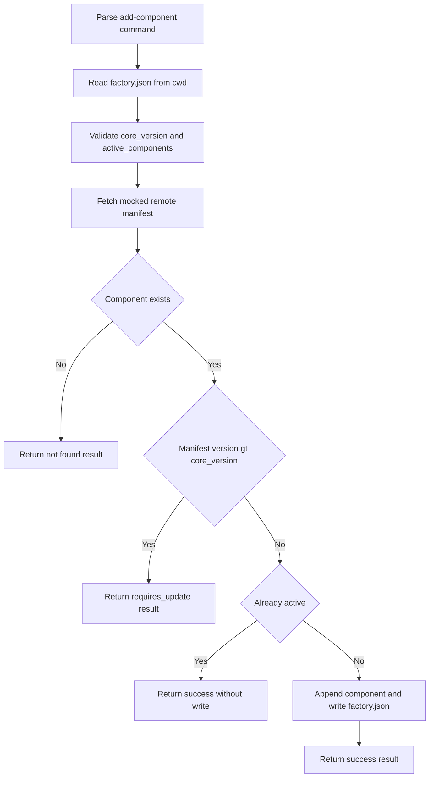

# Design Log #1: add-component command

## Background

- The CLI entrypoint is [`src/index.ts`](src/index.ts), which boots [`Application.run()`](src/Classes/Core/Application.ts:45).
- Default command registration happens in [`DefaultCommands.make()`](src/Classes/Core/Command/DefaultCommands.ts:24).
- Commands are declared through [`CommandRegistry.registerCommand()`](src/Classes/Core/Command/CommandRegistry.ts:129) and executed lazily by [`CommandHandler.handleCommandAction()`](src/Classes/Core/Command/CommandHandler.ts:127).
- Command classes live in [`src/Classes/Command/`](src/Classes/Command/) and typically expose [`execute()`](src/Classes/Command/DockerComposeStatusCommand.ts:26).
- The package already depends on [`semver`](package.json) and Commander via [`package.json`](package.json).

## Problem

Add a new non-interactive CLI command `lab add-component <name>` that reads local [`factory.json`](factory.json), compares the local `core_version` against a remote component manifest version, updates `active_components` when allowed, and supports strict machine-readable output with `--json`.

## Questions and Answers

### Q1

Should non-`--json` mode also remain non-interactive?

### A1

Yes. Both modes remain non-interactive.

### Q2

How should an already active component be handled?

### A2

Treat it as success and do not rewrite [`factory.json`](factory.json).

## Design

### Command shape

- Register a new command signature `add-component <name>` in [`DefaultCommands.make()`](src/Classes/Core/Command/DefaultCommands.ts:24).
- Use file name [`src/Classes/Command/AddComponentCommand.ts`](src/Classes/Command/AddComponentCommand.ts) and class name `AddComponentCommand` to match existing conventions such as [`ProjectInitCommand`](src/Classes/Command/ProjectInitCommand.ts) and [`DockerComposeStatusCommand`](src/Classes/Command/DockerComposeStatusCommand.ts).
- Add Commander option `--json` through the registry options array in [`DefaultCommands.make()`](src/Classes/Core/Command/DefaultCommands.ts:24).

### Execution flow



### File IO strategy

- Read [`factory.json`](factory.json) from [`AppContext.cwd`](src/Classes/Core/AppContext.ts:150).
- Validate the parsed payload as a plain object with:
  - `core_version` as non-empty string
  - `active_components` as array of strings
- Preserve valid JSON output by catching:
  - missing file
  - invalid JSON parse errors
  - invalid shape errors
  - manifest fetch failures
  - write failures

### Manifest strategy

- Keep the remote manifest as a mocked async function for now.
- Place it in a small dedicated helper module rather than inline if implementation wants unit-testable separation.
- Expected mocked payload:
  - `news` -> `1.8.0`
  - `hero` -> `1.0.0`

### Version comparison

- Use [`semver`](package.json) for all version decisions.
- Treat `manifestVersion > coreVersion` as `requires_update`.
- Treat `manifestVersion <= coreVersion` as eligible for success.
- Invalid semver values from local or remote data should be surfaced as handled command errors.

### Output strategy

- In `--json` mode:
  - print exactly one JSON object to stdout
  - do not emit greeting text, prompts, colors, stack traces, or extra whitespace lines before or after the JSON payload
  - serialize with `JSON.stringify` and terminate with a newline
- In non-JSON mode:
  - still remain non-interactive
  - use existing console patterns for human-readable output
  - colored output is acceptable unless a shared no-color mechanism is introduced for the command

### Error strategy

- Add a command-local responder that centralizes success and error emission.
- Do not rely on the global fatal error formatter in [`Application.run()`](src/Classes/Core/Application.ts:45) for expected user-facing command failures when `--json` is active, because it currently prints chalk-colored fatal messages to stderr.
- Prefer handling expected errors inside [`AddComponentCommand.execute()`](src/Classes/Command/AddComponentCommand.ts:1) and resolving successfully after emitting the correct payload.
- Reserve thrown exceptions for truly unexpected failures only if they are first converted into strict JSON in `--json` mode.

### Prompt and color suppression

- This command should not invoke [`inquirer.prompt()`](src/Classes/Command/ProjectInitCommand.ts:68) at all.
- `--json` suppression therefore means:
  - no prompts by design
  - no `chalk` formatted output inside the command
  - no decorative intro or extra logs from the command itself
- Because [`Application.showFancyIntro()`](src/Classes/Core/Application.ts:92) currently prints a greeting before command handling, implementation should either:
  1. add an early global detection for `--json` in [`Application.run()`](src/Classes/Core/Application.ts:45) or [`Application.showFancyIntro()`](src/Classes/Core/Application.ts:92) so intro output is skipped, or
  2. add a context-level machine-output flag set before intro rendering

Option 2 is preferred because it scales to future machine-readable commands.

### Tests

- Update [`test/DefaultCommands.test.ts`](test/DefaultCommands.test.ts) to assert registration of `add-component <name>` and its `--json` option definition.
- Add a dedicated test file such as [`test/AddComponentCommand.test.ts`](test/AddComponentCommand.test.ts).
- Cover at minimum:
  - component not found
  - requires update when remote version is greater
  - success and file write when eligible and inactive
  - success without write when already active
  - invalid or missing [`factory.json`](factory.json)
  - strict JSON mode emits parseable JSON only
- If intro suppression is implemented globally, add tests around [`Application.showFancyIntro()`](src/Classes/Core/Application.ts:92) or [`Application.run()`](src/Classes/Core/Application.ts:45) behavior for `--json`.

## Implementation Plan

1. Edit [`src/Classes/Core/Command/DefaultCommands.ts`](src/Classes/Core/Command/DefaultCommands.ts) to register `add-component <name>` with `--json`.
2. Create [`src/Classes/Command/AddComponentCommand.ts`](src/Classes/Command/AddComponentCommand.ts) with an `execute` method that:
   - reads [`factory.json`](factory.json)
   - validates local config
   - fetches the mocked manifest
   - compares versions via semver
   - appends to `active_components` only when needed
   - emits either strict JSON or human-readable output
3. Create a helper only if useful for separation, for example [`src/Classes/Core/Factory/ComponentManifest.ts`](src/Classes/Core/Factory/ComponentManifest.ts), to host the mocked async manifest fetch.
4. Edit [`src/Classes/Core/Application.ts`](src/Classes/Core/Application.ts) and possibly [`src/Classes/Core/AppContext.ts`](src/Classes/Core/AppContext.ts) to support a global machine-output flag so `--json` suppresses the intro banner before command execution.
5. Add or update tests in [`test/DefaultCommands.test.ts`](test/DefaultCommands.test.ts) and [`test/AddComponentCommand.test.ts`](test/AddComponentCommand.test.ts).

## Examples

### Success JSON

```json
{ "status": "success", "component": "news", "message": "Component added to factory.json." }
```

### Already active JSON

```json
{ "status": "success", "component": "hero", "message": "Component added to factory.json." }
```

Implementation note: same payload as success, but no file write occurs.

### Not found JSON

```json
{ "status": "error", "message": "Component not found in factory manifest." }
```

### Requires update JSON

```json
{ "status": "requires_update", "component": "news", "current_core_version": "1.5.0", "required_core_version": "1.8.0", "message": "Update required. Run lab upgrade." }
```

### Invalid config JSON

```json
{ "status": "error", "message": "Invalid factory.json configuration." }
```

## Trade-offs

- Handling `--json` only inside [`AddComponentCommand`](src/Classes/Command/AddComponentCommand.ts) is simpler, but it is insufficient because [`Application.showFancyIntro()`](src/Classes/Core/Application.ts:92) already writes to stdout before the command runs.
- Adding a reusable machine-output flag touches more files, but it prevents future JSON commands from duplicating startup suppression logic.
- Keeping the manifest fetch mocked inside the command is fastest, but a helper module improves testability and keeps [`AddComponentCommand`](src/Classes/Command/AddComponentCommand.ts) focused on orchestration.

## Implementation Results

- Added [`AddComponentCommand`](src/Classes/Command/AddComponentCommand.ts) with strict JSON responses, local [`factory.json`](factory.json) validation, semver gating, and safe write behavior.
- Added mocked manifest helper [`fetchComponentManifest()`](src/Classes/Core/Factory/ComponentManifest.ts:23) in [`src/Classes/Core/Factory/ComponentManifest.ts`](src/Classes/Core/Factory/ComponentManifest.ts).
- Registered `add-component <name>` with `--json` in [`DefaultCommands.make()`](src/Classes/Core/Command/DefaultCommands.ts:24).
- Added machine-readable startup suppression in [`AppContext.isMachineReadableOutput`](src/Classes/Core/AppContext.ts:158), [`Application.prepareOutputMode()`](src/Classes/Core/Application.ts:73), and [`Application.showFancyIntro()`](src/Classes/Core/Application.ts:92).
- Added tests in [`test/AddComponentCommand.test.ts`](test/AddComponentCommand.test.ts), [`test/Application.test.ts`](test/Application.test.ts), and updated [`test/DefaultCommands.test.ts`](test/DefaultCommands.test.ts).
- Test execution has not yet been run in this implementation step, so no pass/fail counts are recorded yet.

### Deviations from original design

- Added a machine-readable fallback in [`Application.run()`](src/Classes/Core/Application.ts:45) that emits a JSON error payload for unexpected fatal errors during `--json` execution.
