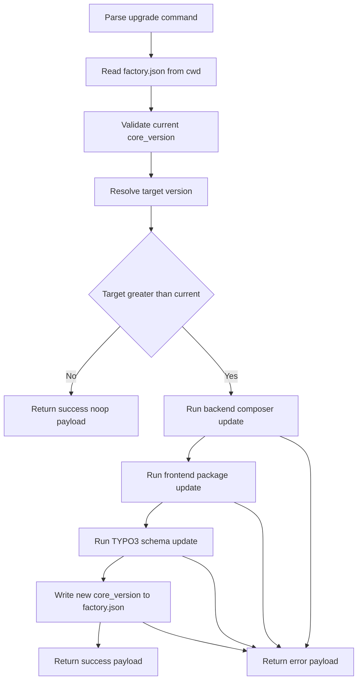

# Design Log #2: upgrade command

## Background

- The CLI entrypoint is [`src/index.ts`](src/index.ts), which boots [`Application.run()`](src/Classes/Core/Application.ts:45).
- Default command registration happens in [`DefaultCommands.make()`](src/Classes/Core/Command/DefaultCommands.ts:24).
- Commands are declared through [`CommandRegistry.registerCommand()`](src/Classes/Core/Command/CommandRegistry.ts:129) and executed lazily by [`CommandHandler.handleCommandAction()`](src/Classes/Core/Command/CommandHandler.ts:127).
- Existing command files live in [`src/Classes/Command/`](src/Classes/Command/), for example [`AddComponentCommand`](src/Classes/Command/AddComponentCommand.ts:64).
- Machine-readable output already has global support through [`AppContext.isMachineReadableOutput`](src/Classes/Core/AppContext.ts:158), [`Application.prepareOutputMode()`](src/Classes/Core/Application.ts:86), and the JSON fatal fallback in [`Application.run()`](src/Classes/Core/Application.ts:58).
- The project already depends on [`commander`](package.json), [`semver`](package.json), and Node built-ins, so the new command can stay dependency-light.
- Existing design log structure is established by [`001-add-component-command.md`](.design-log/001-add-component-command.md).

## Problem

Add a new non-interactive command `lab upgrade` for a headless Nuxt and TYPO3 project. The command must read [`factory.json`](factory.json), resolve a target version from `--target <version>` or a mocked remote lookup, compare versions with semver, execute backend and frontend upgrade steps asynchronously, update [`factory.json`](factory.json) only after full success, and emit strict JSON when `--json` is used.

## Questions and Answers

### Q1

What JSON contract should be treated as the required source of truth for success and noop cases?

### A1

Use one success schema for both upgraded and noop cases with exactly `status`, `message`, `previous_version`, and `new_version`.

### Q2

How should noop output represent version values when the requested target is not newer than the installed version?

### A2

Use the current installed version for both `previous_version` and `new_version`, because the project state did not change. The `message` should explain that the requested target was not newer.

### Q3

Should the frontend install always use npm, or should it detect the package manager from the target project?

### A3

Prefer a small package-manager-aware decision based on lockfiles in [`frontend/`](frontend/). Use npm as fallback when no lockfile is found. This keeps the command safer for real projects while still matching the requirement.

## Design

### Command shape

- Register a new command signature `upgrade` in [`DefaultCommands.make()`](src/Classes/Core/Command/DefaultCommands.ts:24).
- Register two Commander options in the command registry:
  - `--target <version>`
  - `--json`
- Add a new handler file [`src/Classes/Command/UpgradeCommand.ts`](src/Classes/Command/UpgradeCommand.ts).
- Keep the command non-interactive in both human and JSON modes.

### Existing architecture fit

- Registration should mirror [`add-component <name>`](src/Classes/Core/Command/DefaultCommands.ts:231): define the command in [`DefaultCommands.make()`](src/Classes/Core/Command/DefaultCommands.ts:24) and lazy-load the class through the registry.
- The command should implement the standard async `execute` entrypoint used by command classes such as [`AddComponentCommand.execute()`](src/Classes/Command/AddComponentCommand.ts:66).
- No change is required in [`src/index.ts`](src/index.ts), [`CommandRegistry`](src/Classes/Core/Command/CommandRegistry.ts), or [`CommandHandler`](src/Classes/Core/Command/CommandHandler.ts), because current registration and dispatch are already sufficient.
- No global JSON-output change is expected, because startup suppression already exists through [`AppContext.isMachineReadableOutput`](src/Classes/Core/AppContext.ts:158).

### Execution flow



### File and directory assumptions

- The command runs from the project root resolved by [`AppContext.cwd`](src/Classes/Core/AppContext.ts:150).
- It expects these paths to exist before shell execution:
  - [`factory.json`](factory.json)
  - [`backend/`](backend/)
  - [`frontend/`](frontend/)
- Missing required files or directories should be handled as command errors, not fatal uncaught exceptions.

### Version resolution

- Read [`factory.json`](factory.json) and parse `core_version` as the installed version.
- Validate `core_version` with [`semver`](package.json), using normalized semver strings for comparison and writeback.
- Resolve the target version in this order:
  1. `--target <version>` when provided
  2. mocked async remote lookup helper when omitted
- Suggested helper name: `fetchLatestFactoryCoreVersion()` inside [`src/Classes/Command/UpgradeCommand.ts`](src/Classes/Command/UpgradeCommand.ts) initially, or a small companion module if the command grows.
- If `semver.gt target current` is false, return early without executing any child process and without modifying [`factory.json`](factory.json).

### Shell execution strategy

- Do not use synchronous process execution such as [`child_process.execSync`](src/Classes/Command/NpmCommand.ts:125), because the new command must be safely async and JSON-safe.
- Use a Promise-based wrapper around Node child process APIs, preferably `spawn` with explicit args and buffered `stdout` and `stderr`.
- Keep subprocess output out of direct terminal inheritance in JSON mode, otherwise strict JSON would be polluted.
- Suggested sequential steps:
  1. in [`backend/`](backend/): `composer require my-agency/factory-core:<target_version> --with-all-dependencies`
  2. in [`frontend/`](frontend/): install `@my-agency/factory-nuxt-layer@<target_version>` with detected package manager
  3. in [`backend/`](backend/): `vendor/bin/typo3 database:updateschema`
- Model each step with a structured identifier, for example:
  - `backend_composer_require`
  - `frontend_dependency_install`
  - `backend_database_updateschema`
- If any step fails, stop the sequence immediately and do not write the new version to [`factory.json`](factory.json).

### Frontend package-manager detection

- Detect lockfiles inside [`frontend/`](frontend/):
  - [`frontend/pnpm-lock.yaml`](frontend/pnpm-lock.yaml) -> `pnpm add`
  - [`frontend/yarn.lock`](frontend/yarn.lock) -> `yarn add`
  - [`frontend/package-lock.json`](frontend/package-lock.json) -> `npm install`
- Fallback to npm when no supported lockfile exists.
- Keep the first implementation small and local to the upgrade command unless more commands need this behavior.

### Write strategy

- Parse [`factory.json`](factory.json) into an object.
- Preserve unrelated keys.
- Update only `core_version` after all three child-process steps succeed.
- Serialize with `JSON.stringify payload null 2` style formatting and a trailing newline, matching existing file-write style in [`AddComponentCommand`](src/Classes/Command/AddComponentCommand.ts:105).

### Output contract

- Human mode should print concise progress and final status messages only.
- JSON mode must print exactly one JSON object to stdout followed by one newline.
- JSON mode must not emit prompts, banners, color formatting, raw subprocess logs, or stack traces.

#### Success JSON contract

Both upgraded and noop responses use exactly this shape:

```json
{
  "status": "success",
  "message": "Upgraded factory core from 1.2.3 to 1.3.0.",
  "previous_version": "1.2.3",
  "new_version": "1.3.0"
}
```

- Upgraded case: `previous_version` is the installed version before the command and `new_version` is the applied target.
- Noop case: `previous_version` and `new_version` are both the current installed version because no state changed.

#### Error JSON contract

Use a structured error payload so AI callers can detect the failing step and inspect stderr:

```json
{
  "status": "error",
  "message": "Frontend dependency install failed.",
  "previous_version": "1.2.3",
  "new_version": "1.3.0",
  "failed_step": "frontend_dependency_install",
  "stderr": "npm ERR ..."
}
```

- `previous_version` should be the installed version when known, otherwise `null`.
- `new_version` should be the resolved target version when known, otherwise `null`.
- `stderr` should be the buffered stderr for the failing step, trimmed but not reformatted.

### Error handling

- Keep expected failures inside [`UpgradeCommand`](src/Classes/Command/UpgradeCommand.ts) with local `try` and `catch` handling, similar in spirit to [`AddComponentCommand.handle()`](src/Classes/Command/AddComponentCommand.ts:71).
- Convert validation errors, missing files, invalid semver input, package-manager detection problems, child-process failures, and file-write failures into controlled command responses.
- Reserve the global fallback in [`Application.run()`](src/Classes/Core/Application.ts:58) for truly unexpected exceptions only.

### Tests

- Update [`test/DefaultCommands.test.ts`](test/DefaultCommands.test.ts) to assert registration of `upgrade` with both `--target <version>` and `--json`.
- Add [`test/UpgradeCommand.test.ts`](test/UpgradeCommand.test.ts).
- Cover at minimum:
  - explicit target upgrade success
  - mocked latest-version success when `--target` is omitted
  - noop when target equals current
  - noop when target is lower than current
  - missing or invalid [`factory.json`](factory.json)
  - invalid current or target semver
  - missing [`backend/`](backend/) or [`frontend/`](frontend/)
  - frontend package-manager detection branches
  - failing backend composer step with captured stderr
  - failing frontend install step with captured stderr
  - failing TYPO3 schema step with captured stderr
  - write to [`factory.json`](factory.json) happens only after all shell steps succeed
  - strict JSON mode emits one parseable object only

## Implementation Plan

1. Edit [`src/Classes/Core/Command/DefaultCommands.ts`](src/Classes/Core/Command/DefaultCommands.ts) to register `upgrade` with `--target <version>` and `--json`.
2. Create [`src/Classes/Command/UpgradeCommand.ts`](src/Classes/Command/UpgradeCommand.ts) with a non-interactive async `execute` flow that:
   - reads and validates [`factory.json`](factory.json)
   - resolves the target version from CLI or mocked remote lookup
   - compares current and target versions with semver
   - returns early on noop
   - runs backend, frontend, and schema update steps sequentially
   - writes `core_version` only after full success
   - emits human or strict JSON output from one responder
3. Add a small local child-process wrapper inside [`src/Classes/Command/UpgradeCommand.ts`](src/Classes/Command/UpgradeCommand.ts) or extract a tiny helper only if the file becomes too large.
4. Add package-manager detection logic for [`frontend/`](frontend/) with npm fallback.
5. Add [`test/UpgradeCommand.test.ts`](test/UpgradeCommand.test.ts) and update [`test/DefaultCommands.test.ts`](test/DefaultCommands.test.ts).

## Examples

### CLI usage

```bash
lab upgrade --target 1.3.0
lab upgrade --json
```

### Success JSON after upgrade

```json
{
  "status": "success",
  "message": "Upgraded factory core from 1.2.3 to 1.3.0.",
  "previous_version": "1.2.3",
  "new_version": "1.3.0"
}
```

### Success JSON for noop

```json
{
  "status": "success",
  "message": "No upgrade required. Requested target 1.2.3 is not newer than current 1.2.3.",
  "previous_version": "1.2.3",
  "new_version": "1.2.3"
}
```

### Error JSON for failing shell step

```json
{
  "status": "error",
  "message": "Backend composer update failed.",
  "previous_version": "1.2.3",
  "new_version": "1.3.0",
  "failed_step": "backend_composer_require",
  "stderr": "Composer could not resolve dependencies"
}
```

## Trade-offs

- Keeping all helpers inside [`UpgradeCommand`](src/Classes/Command/UpgradeCommand.ts) minimizes file count, but it can make testing harder once process execution and package-manager detection grow.
- Extracting helper functions improves unit-testability, but it adds more surface area for a feature that currently has one caller.
- Buffering subprocess output is safer for strict JSON mode than inheriting stdio, but it means human mode will show curated progress instead of raw streaming logs.
- Using package-manager detection adds a small amount of complexity, but it avoids forcing npm in projects that already standardize on yarn or pnpm.
- Not attempting rollback keeps the implementation simple and predictable. The safe boundary is to delay the [`factory.json`](factory.json) write until the shell sequence finishes successfully.

## Implementation Results

- Added [`UpgradeCommand`](src/Classes/Command/UpgradeCommand.ts) with async version resolution, buffered child-process execution, package-manager detection, controlled error handling, and strict JSON responses.
- Registered `upgrade` in [`DefaultCommands.make()`](src/Classes/Core/Command/DefaultCommands.ts:24) with `--target <version>` and `--json`.
- Added focused coverage in [`test/UpgradeCommand.test.ts`](test/UpgradeCommand.test.ts) and extended registration assertions in [`test/DefaultCommands.test.ts`](test/DefaultCommands.test.ts).
- Deviation from the original design: noop JSON now uses `status: "noop"` and the upgraded success message is exactly `Core upgraded and database migrated successfully.` to match the approved task contract for AI orchestration.
- Verification command results will be appended after running the relevant Jest suite.
