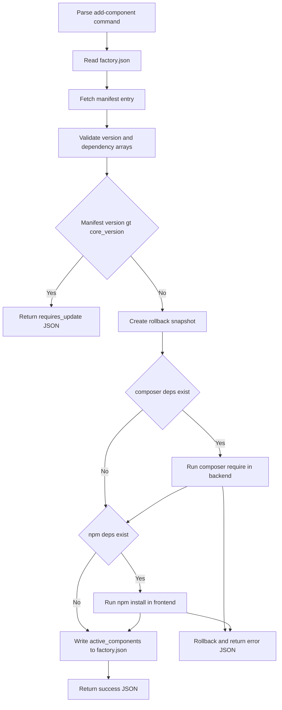

# Design Log #3: add-component dependency installs

## Background

- [`lab add-component <name>`](src/Classes/Command/AddComponentCommand.ts:64) already exists and is documented in [`.design-log/001-add-component-command.md`](.design-log/001-add-component-command.md).
- The current command reads [`factory.json`](factory.json), validates `core_version`, checks the remote manifest version, and appends to `active_components` in [`factory.json`](factory.json) via [`AddComponentCommand.handle()`](src/Classes/Command/AddComponentCommand.ts:71).
- The current manifest type [`FactoryComponentManifestEntry`](src/Classes/Core/Factory/ComponentManifest.ts:17) only includes `version`.
- Existing coverage in [`test/AddComponentCommand.test.ts`](test/AddComponentCommand.test.ts:12) focuses on manifest lookup, version gating, config validation, and JSON-only output.
- The prior design in [`.design-log/001-add-component-command.md`](.design-log/001-add-component-command.md) has already been implemented, so this dependency-install extension should use a new design log instead of rewriting the original design sections.

## Problem

Extend `lab add-component <name>` so it reads dependency arrays from the remote component manifest, installs external dependencies before mutating [`factory.json`](factory.json), fully rolls back on install failure, and returns strict JSON success and error payloads that include dependency details.

## Questions and Answers

### Q1

Should this change update [`.design-log/001-add-component-command.md`](.design-log/001-add-component-command.md) or use a new design log?

### A1

Use a new design log. [`.design-log/001-add-component-command.md`](.design-log/001-add-component-command.md) documents the already-shipped base command. This task is a follow-up feature with additional process orchestration and rollback rules.

### Q2

If backend dependency installation succeeds and frontend dependency installation fails, what rollback target should the plan assume?

### A2

Rollback must undo both dependency installs and any pending [`factory.json`](factory.json) changes.

### Q3

What is still ambiguous for implementation?

### A3

The requirement defines the failure JSON `message` shape, but not the exact success payload shape beyond including installed dependencies. The plan assumes success JSON should keep existing fields and add dependency arrays so callers can inspect what was installed.

## Design

### Manifest type changes

- Extend [`FactoryComponentManifestEntry`](src/Classes/Core/Factory/ComponentManifest.ts:17) to support optional dependency arrays:

```ts
interface FactoryComponentManifestEntry {
    version: string;
    composer_dependencies?: string[];
    npm_dependencies?: string[];
}
```

- Validation rules for each optional property:
  - missing -> treat as empty list
  - present but not an array of non-empty strings -> invalid factory manifest configuration
  - present and empty -> no install step for that package manager

### Command flow change

[`AddComponentCommand.handle()`](src/Classes/Command/AddComponentCommand.ts:71) should change from write-first orchestration to install-first orchestration.



### Shell execution strategy

- Use [`child_process.exec()`](src/Classes/Command/AddComponentCommand.ts:1) as required, wrapped in a Promise-returning helper inside [`AddComponentCommand`](src/Classes/Command/AddComponentCommand.ts:64) or a tiny local helper.
- Execute sequentially, never in parallel:
  1. in [`backend/`](backend/): `composer require <packages> --with-all-dependencies`
  2. in [`frontend/`](frontend/): `npm install <packages>`
- Buffer `stdout` and `stderr` instead of inheriting stdio so JSON mode stays strict.
- Quote or escape package arguments defensively when building the command string, because dependency coordinates can contain version operators such as `^`.

### Rollback strategy

- Do not write [`factory.json`](factory.json) until all install steps succeed.
- Full rollback target for install failures:
  - restore backend dependency state
  - restore frontend dependency state
  - preserve [`factory.json`](factory.json) exactly as it was before execution
- Recommended rollback plan for implementation:
  1. snapshot relevant backend files before `composer require`, at minimum [`backend/composer.json`](backend/composer.json) and [`backend/composer.lock`](backend/composer.lock) when present
  2. snapshot relevant frontend files before `npm install`, at minimum [`frontend/package.json`](frontend/package.json) and [`frontend/package-lock.json`](frontend/package-lock.json) when present
  3. if a step fails, restore the saved file contents
  4. run cleanup reinstalls only when required to make restored manifests and lockfiles consistent
- Assumption: restoring manifest and lockfile files is the safest rollback baseline for this CLI. Exact cleanup of installed vendor or node_modules content can be refined in code mode if tests or project structure require it.
- Rollback failures should not hide the original install failure. The primary JSON error message should still report dependency installation failure and include the failing step stderr.

### JSON output contract

- JSON mode must still print exactly one object plus one trailing newline via [`AddComponentCommand.respond()`](src/Classes/Command/AddComponentCommand.ts:172).
- No subprocess logs, prompts, banners, or stack traces may leak to stdout in JSON mode.

#### Success JSON

Assumed contract:

```json
{
  "status": "success",
  "component": "news",
  "message": "Component added to factory.json.",
  "installed_dependencies": {
    "composer": ["georgringer/news:^11.4"],
    "npm": ["@t3headless/nuxt-typo3-news:^2.0"]
  }
}
```

- `installed_dependencies.composer` and `installed_dependencies.npm` should always be arrays in success output, using empty arrays when no dependencies were requested.
- This keeps the payload machine-readable and satisfies the requirement to include installed dependencies.

#### Error JSON

Required minimum contract:

```json
{ "status": "error", "message": "Failed to install dependencies: npm ERR ..." }
```

- Use the exact `message` prefix `Failed to install dependencies:` for install failures.
- Prefer stderr from the failing subprocess, trimmed to one string.
- For config validation, manifest lookup, and version gating, keep existing JSON shapes unless implementation approval changes the broader contract.

### Write strategy

- Treat [`factory.json`](factory.json) as the final commit step.
- Only append the component to `active_components` after all requested dependency installs complete successfully.
- Preserve the current behavior for already-active components unless implementation decides dependency installation must still run for them. Current plan assumes already-active remains an early success with no install and no rewrite, because the command semantic is add, not reconcile.

### Test coverage

- Update [`test/AddComponentCommand.test.ts`](test/AddComponentCommand.test.ts:12).
- Mock both [`fetchComponentManifest()`](src/Classes/Core/Factory/ComponentManifest.ts:27) and [`child_process.exec()`](src/Classes/Command/AddComponentCommand.ts:1).
- Cover at minimum:
  - manifest entry with both dependency arrays runs composer then npm before writing [`factory.json`](factory.json)
  - manifest entry with only composer dependencies skips npm
  - manifest entry with only npm dependencies skips composer
  - empty dependency arrays skip child-process calls and still allow success
  - already-active component returns success without installs or file rewrite
  - composer failure returns strict JSON error and leaves [`factory.json`](factory.json) unchanged
  - npm failure after composer success triggers rollback plan and leaves [`factory.json`](factory.json) unchanged
  - invalid dependency array types return manifest configuration error
  - success JSON includes `installed_dependencies` arrays
  - strict JSON mode still emits one parseable object only

## Implementation Plan

1. Extend [`FactoryComponentManifestEntry`](src/Classes/Core/Factory/ComponentManifest.ts:17) and manifest validation in [`AddComponentCommand.validateManifestEntry()`](src/Classes/Command/AddComponentCommand.ts:165) for optional dependency arrays.
2. Refactor [`AddComponentCommand.handle()`](src/Classes/Command/AddComponentCommand.ts:71) so dependency resolution and installation happen before any mutation of [`factory.json`](factory.json).
3. Add an async [`child_process.exec()`](src/Classes/Command/AddComponentCommand.ts:1) wrapper that captures `stdout` and `stderr`, supports cwd selection, and rejects with the buffered failure output.
4. Add sequential install helpers for [`backend/`](backend/) composer and [`frontend/`](frontend/) npm using the manifest dependency arrays.
5. Add rollback snapshot and restore helpers for backend and frontend dependency files; ensure install failure reports the original stderr while reverting local changes.
6. Update success JSON emitted by [`AddComponentCommand.respond()`](src/Classes/Command/AddComponentCommand.ts:172) to include installed dependency arrays.
7. Expand [`test/AddComponentCommand.test.ts`](test/AddComponentCommand.test.ts:12) to cover orchestration order, rollback, strict JSON output, and manifest validation for dependency arrays.

## Examples

### Manifest entry with dependencies

```json
{
  "news": {
    "version": "1.8.0",
    "composer_dependencies": ["georgringer/news:^11.4"],
    "npm_dependencies": ["@t3headless/nuxt-typo3-news:^2.0"]
  }
}
```

### Success JSON with no external dependencies

```json
{
  "status": "success",
  "component": "hero",
  "message": "Component added to factory.json.",
  "installed_dependencies": {
    "composer": [],
    "npm": []
  }
}
```

### Install failure JSON

```json
{ "status": "error", "message": "Failed to install dependencies: Composer could not resolve dependencies" }
```

## Trade-offs

- Updating [`.design-log/001-add-component-command.md`](.design-log/001-add-component-command.md) would keep all command history in one file, but it would blur the boundary between shipped behavior and a later feature extension.
- Using [`child_process.exec()`](src/Classes/Command/AddComponentCommand.ts:1) matches the requirement, but it requires careful command-string escaping compared with argument-safe spawn APIs.
- Full rollback is safer for callers than delaying only the [`factory.json`](factory.json) write, but it adds file snapshot complexity and more failure paths to test.
- Returning only the required install-failure `message` keeps the error contract strict and simple, but it exposes less structured failure metadata than the newer [`upgrade`](src/Classes/Command/UpgradeCommand.ts:1) design does.
