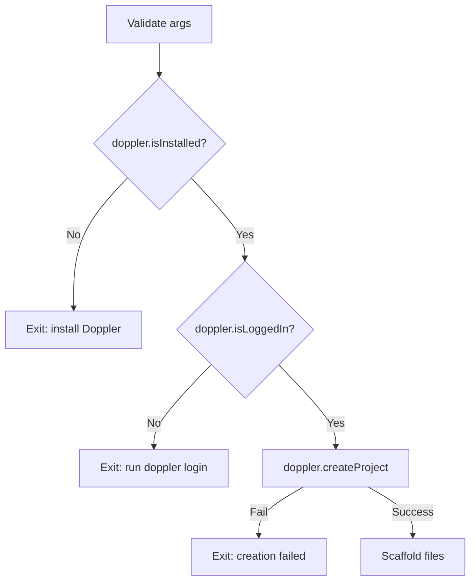

# Design Log #4: Doppler project creation in factory:create

## Background

- [`factory:create`](src/Classes/Command/FactoryCreateCommand.ts) scaffolds new client projects from Factory templates (see Factory Design Log #002).
- The [`Doppler`](src/Classes/Api/Doppler.ts) API class already supports `isInstalled()`, `isLoggedIn`, `login()`, `generateServiceToken()`, and `checkIfValidServiceTokenExists()`.
- [`DockerAppInit.fillEmptyValuesInEnvFile()`](src/Classes/Core/DockerApp/DockerAppInit.ts:251) reads `DOPPLER_PROJECT` and `DOPPLER_CONFIG` from `.env` and generates service tokens during `lab up`.
- The Factory templates contain `{{DOPPLER_PROJECT}}` placeholders in `.env.template` files that need replacement at scaffold time.
- The prior `factory:create` implementation only replaced `{{PROJECT_NAME}}` — see [`FactoryCreateCommand.replacePlaceholders()`](src/Classes/Command/FactoryCreateCommand.ts:103).

## Problem

Extend `lab factory:create` to:
1. Validate that Doppler CLI is installed and authenticated
2. Create a Doppler project matching the client project name
3. Replace `{{DOPPLER_PROJECT}}` in generated template files alongside `{{PROJECT_NAME}}`

## Questions and Answers

### Q1. Should `createProject` handle the case where the project already exists?

**Answer:** No. If a project already exists, `doppler projects create` returns an error and the command fails. This is the correct behavior — `factory:create` already fails if the target directory exists, so a pre-existing Doppler project is equally invalid for a "new project" flow.

### Q2. Should the Doppler checks happen before or after directory creation?

**Answer:** Before. If Doppler setup fails, no files should be created. This prevents orphaned directories that lack a working Doppler project.

## Design

### Doppler.ts additions

```ts
public createProject(projectName: string): void
public createEnvironment(projectName: string, envName: string, slug?: string): void
```

Both use `childProcess.execSync` with `stdio: 'pipe'` and `--json` flag, following the existing pattern in `generateServiceToken()` and `_getServiceTokens()`.

### FactoryCreateCommand.ts changes

#### Doppler gate (before scaffolding)



#### Generic placeholder replacement

Refactored from single-placeholder to a `Record<string, string>` map:

```ts
private replacePlaceholders(dir: string, projectName: string) {
    const replacements: Record<string, string> = {
        '{{PROJECT_NAME}}': projectName,
        '{{DOPPLER_PROJECT}}': projectName
    };
    this.replaceInDir(dir, replacements);
}
```

The `replaceInDir` helper iterates files recursively, checks for any placeholder occurrence, and applies all replacements in a single pass. Binary files are silently skipped via try/catch on UTF-8 read.

### Bug fix: FactoryAddCommand argument passing

Discovered during testing that [`FactoryAddCommand.execute()`](src/Classes/Command/FactoryAddCommand.ts:70) had a signature mismatch with [`CommandHandler`](src/Classes/Core/Command/CommandHandler.ts:150):

- **Before:** `execute(componentName: string, context: AppContext, stack: CommandStack, cmd: Command)` — expected `componentName` as first arg
- **Problem:** `CommandHandler` builds `handlerArgs = [cmd, context, this._stack, ...args]` where `cmd` is the Commander `Command` object, not the positional argument
- **After:** `execute(...args: any[])` with `cmd.args[0]` to extract the positional argument, matching the pattern used by [`FactoryCreateCommand`](src/Classes/Command/FactoryCreateCommand.ts:15)

This fix is unrelated to Doppler but was a prerequisite for the E2E test pipeline to pass.

## Implementation Plan

1. Add `createProject()` and `createEnvironment()` to [`Doppler.ts`](src/Classes/Api/Doppler.ts)
2. Add Doppler gate to [`FactoryCreateCommand.ts`](src/Classes/Command/FactoryCreateCommand.ts) before directory creation
3. Refactor `replacePlaceholders` to generic multi-placeholder system
4. Fix [`FactoryAddCommand.execute()`](src/Classes/Command/FactoryAddCommand.ts:70) argument extraction
5. Build and run E2E test pipeline

## Trade-offs

- **Hard Doppler requirement**: `factory:create` fails without Doppler. This is intentional — all Factory projects use Doppler for secret management. A `--skip-doppler` flag could be added later if needed.
- **No rollback on Doppler**: If file scaffolding fails after Doppler project creation, the Doppler project persists. This is acceptable because orphaned projects are harmless and easily cleaned up.
- **`createEnvironment` unused**: Added for API completeness but not called — Doppler's defaults (dev/stg/prd) suffice. Available for future custom environment needs.

## Implementation Results

### Files modified

- `src/Classes/Api/Doppler.ts` — added `createProject()` (4 lines) and `createEnvironment()` (5 lines)
- `src/Classes/Command/FactoryCreateCommand.ts` — Doppler gate (~30 lines), refactored `replacePlaceholders` to generic `replaceInDir` helper
- `src/Classes/Command/FactoryAddCommand.ts` — fixed `execute()` to use `cmd.args[0]` pattern

### Test results

E2E test pipeline (`test-pipeline.sh`) passes all phases:
- Phase 0: Teardown ✔
- Phase 1: Scaffold + Doppler project creation ✔
- Phase 2: Component injection (PageHero, Text) ✔
- Doppler project verified via `doppler projects get -p test-client-auto`
- `.env.template` files contain `DOPPLER_PROJECT=test-client-auto` (placeholder resolved)

### Deviations from design

- Originally planned to create 3 custom Doppler environments. Discovered Doppler auto-creates dev/stg/prd on project creation. Removed explicit environment creation calls.